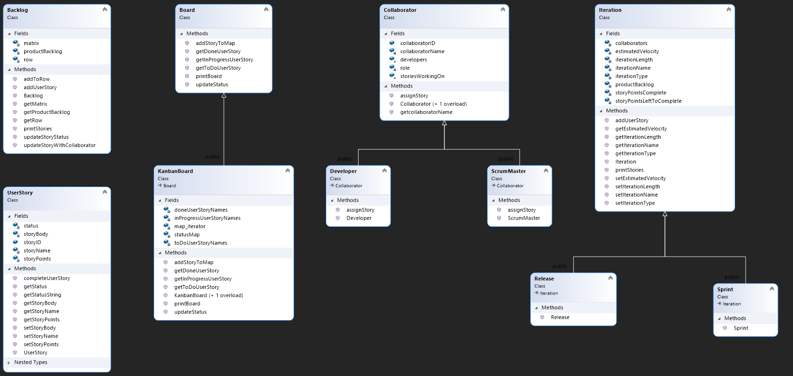

# COP3003_IntegrationProject
An application that offers a project management tool to create and track user stories for teams that use AGILE methodologies. A user story is a description of a feature for an application that is usually less than three sentences long. The collection of user stories for a product is called the product backlog and this can be broken down into releases, and releases can be broken down into short iterations called sprints. This project is designed to make creating, tracking, and allocating user stories to sprints simple and easy by housing the stories in a csv and giving options to the user to interact with the backlog.

A basic layout for a user story looks like this: <br>
As a who      (**Who** wants to accomplish something) <br>
I want a what (**What** I want to accomplish)         <br>
So that       (**Why** I want to accomplish)          <br>

## Demonstration
https://user-images.githubusercontent.com/54412557/145521598-5a32eee4-a7f7-403f-87ab-1ae743b4bea5.mp4

## Documentation
External documentation for this project can be found at https://cpa4001.github.io/COP3003_IntegrationProject/html/ </br>
Make sure to click on the classes or files button and select the class/file that you would like to read more about. </br>

## Diagrams
ClassDiagram.cd has all class diagrams in a file that is compatible with Visual Studio. </br>


## Getting Started
``` sh
> git clone https://github.com/cpa4001/COP3003_IntegrationProject newProjectName
```
Open solution in Visual Studio or IDE of choice

## Built With

- Visual Studio
- C++
- Doxygen

## Contributing
Current Warnings: </br>

- Curent Challenges
   - StoryID jumping by two occasionally
   - Changing the status of a story and having the csv reflect the change
   - Writing developers into the csv

- Future Goals or Contributions
  - Create a frontend using a GUI or website
  - Decrease coupling

## Author
- Christian Apostoli

## License
This project is licensed under the MIT License.

## Acknowledgments

* https://github.com/jfg357
* https://github.com/jehna/readme-best-practices/edit/master/README-default.md
* https://gist.github.com/PurpleBooth/109311bb0361f32d87a2
* https://stackoverflow.com/questions/2340281/check-if-a-string-contains-a-string-in-c
* https://newbedev.com/checking-for-an-empty-file-in-c
* https://stackoverflow.com/questions/3418231/replace-part-of-a-string-with-another-string
* https://stackoverflow.com/questions/16934183/integer-validation-for-input
* Professor Vanselow
* Jairo Garciga
 
 ## History

Milestone 1:
- Users shall be able to create user stories
- Users shall be able to look up user stories created
- System shall be able to save user stories to a csv file
- Users should be able to continuously perform the above until exiting the program

Milestone 2:
- Users shall be able to create iterations
- Users shall be able to enter Developers or Scrum Masters
- Users shall be able to see a Kanban Board (stories that are To Do, In Progress,  Done)
- Program shall have status in csv (To Do, In Progress, or Done) instead of integer
- Users shall be able to get the most recent user story

Final Milestone:
- File Header comments for every file
- Function header comments for function
- Class Diagrams
- Reduced compiler warnings
- External documentation generated through Doxygen
- Code styled according to the Google style guide for C++

## Key Programming Concepts Utilized
- Design and implement a class. [Usage]
  - Shown in the use of multiple classes and separating class declaration in a header file and class implementation in a cpp file
  - Comparison of OO approach and procedural approach on top of UserStory.cpp
   
- Use subclassing to design simple class hierarchies that allow code to be reused for distinct subclasses. [Usage]
  - Shown in the use of inheritance with Collaborator, ScrumMaster, Developer classes, and Iteration, Release, Sprint classes
  - Use of derived objects shown in Source.cpp and when Program creates an Iteration or Collaborator

- Correctly reason about control flow in a program using dynamic dispatch. [Usage]
  - Shown in delaying initialization of Collaborator object in Source.cpp within case 3 in switch block 


- Explain the relationship between object-oriented inheritance (code-sharing and overriding) and subtyping (the idea of a subtype being usable in a context that expects the supertype). [Familiarity]
  - Shown through creating inheritance hierarchies   

- Use object-oriented encapsulation mechanisms such as interfaces and private members. [Usage]
  - Shown in Board class which acts as an interface meaning no attributes and all pure virtual methods
  - Shown in the use of private members between all classes 

- Define and use iterators and other operations on aggregates, including operations that take functions as arguments. [Usage]
  - Shown in the use of overloaded operators including overloading the unary (-) operator with a Backlog object
  - Shown in the methods of the Backlog class 

- Follow best practices for style and readability
  - Shown in decreased compiler warnings using ClangTidy using bugprone*, cppcoreguidelines*, google*, modernize*, readability* checks
  - Shown by following google style guide

- Follow best practices for documentation
   - Shown in external documentation with doxygen
   - Shown in header comment docs for every file and function definition, and for most data structures
